# Documentação técnica — SG-ECREDAC

**Versão:** 1.0  

**Responsável:** Thiago Messias  

**Data:** Agosto de 2026

## 🎯 Sumário

1. [Introdução](#1-introdução)
2. [Visão Geral do Sistema](#2-visão-geral-do-sistema)
3. [Tecnologias Utilizadas](#3-tecnologias-utilizadas)
4. [Arquitetura do Sistema](#4-arquitetura-do-sistema)
5. [Estrutura do Projeto](#5-estrutura-do-projeto)
6. [Autenticação de Controle de Acesso](#6-autenticação-de-controle-de-acesso)
7. [Banco de Dados](#7-banco-de-dados)
8. [Integrações Externas](#8-integrações-externas) # `Ainda não desenvolvido` 
9. [Processamento de arquivos](#9-processamento-de-arquivos)
10. [Regras de Negócio](#10-regras-de-negócio)
11. [Cálculos no processamento](#11-cálculos-no-processamento)
12. [Tratamentos de Erros e logs](#12-tratamentos-de-erros-e-logs)
13. [Segurança](#13-segurança)
14. [Configuração e Instalação](#14-configuração-e-instalação)
15. [Manutenção e Evolução](#15-manutenção-e-evolução)


# **1. Introdução**


### **1.1 Objetivo**

Preparar o sistema para que ele seja capaz de realizar a gestão e apropriação de Crédito Acumulado de ICMS (eCredAc). O sistema será capaz de realizar o processamento de dados fiscais, a validação de inconsistências e a geração automatizada do arquivo digital do eCredAc, contemplando o preenchimento exato de todas as fichas acessórias obrigatórias exigidas pelo fisco paulista.

### **1.2 Finalidade da documentação**

A documentação segue com a importância de mostrar a parte técnica e estrutural do sistema, facilitando o entendimento de seu funcionamento, arquitetura e regras de negócio por terceiros.

### **1.3 Público-Alvo**

A documentação é destinada a qualquer pessoa que necessite compreender o sistema E-CREDAC, incluindo desenvolvedores, analistas, usuários, responsáveis pela manutenção e demais profissionais envolvidos ou interessados em seu funcionamento.

### **1.4 Escopo do Sistema**

O sistema E-CREDAC contempla os processos e funcionalidades relacionados ao gerenciamento, processamento e validação das informações utilizadas pela empresa. Engloba funcionalidades como cadastro, validação, geração de arquivos, geração de fichas, método de rateio, gerenciamento de regras, histórico e acompanhamento dos processos realizados.

# **2. Visão Geral do Sistema**


### **2.1 Descrição do Sistema**

O E-CREDAC é um sistema desenvolvido para centralizar e facilitar os processos realizados pela empresa. Ele integra em uma única aplicação diversos módulos para cadastro, processamento, validação e gerenciamento de informações, permitindo uma gestão de dados eficiente e organizada.

### **2.2 Principais Funcionalidades**

Entre as principais funcionalidades do E-CREDAC estão:

- Cadastro de empresas e produtos
- Processamento dos arquivos SPED, XML, XLSX
- Validação dos dados fiscais
- Exportação dos dados para XLSX
- Acompanhamento das atividades por colaborador
- Geração do arquivo E-CREDAC
- Geração das fichas acessórias obrigatórias


### **2.3 Usuário do Sistema**

O sistema é destinado a profissionais responsáveis pelas rotinas fiscais e cadastrais da empresa, tendo como perfis principais:

- **Administrador:** gerenciamento e configuração do sistema.
- **Analista:** execução e análise dos processos.


### **2.4 Fluxo Geral do Sistema**

1. Acesso ao sistema
2. Login/autenticação do usuário
3. Tela inicial (Home)
4. Seleção da funcionalidade desejada
5. Processamento dos dados ou validação
6. Geração do arquivo E-CREDAC
7. Geração das fichas acessórias obrigatórias


# **3. Tecnologias Utilizadas**


| Tipo                  | Tecnologia                                    |
| --------------------- | --------------------------------------------- |
| **Back-end**          | Python 3.10+ com Django 5.2+                  |
| **Banco de Dados**    | PostgreSQL 12+                                |
| **Manipulação Dados** | Pandas, Openpyxl                              |
| **XML**               | xml.etree.ElementTree                         |
| **Admin**             | Django-Jazzmin                                |
| **Front-end**         | HTML, CSS, JavaScript, Bootstrap, FontAwesome |
| **Ambiente**          | python-dotenv (arquivo `.env`)                |


# **4. Arquitetura do Sistema**


### **4.1 Visão Geral da Arquitetura**

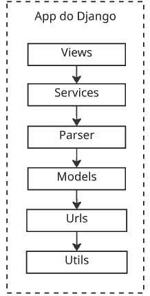

### **4.2 Comunicação entre Componentes**

A comunicação ocorre de forma sequencial, seguindo a estrutura Django:

- **Views:** recebe as requisições do usuário e direciona o fluxo.
- **Services:** executa processos e regras de negócio.
- **Parser:** faz a conversão dos dados.
- **Models:** representa os dados e realiza a comunicação com o banco (ORM Django).
- **Urls:** mapeia endereços web para funções específicas.
- **Utils:** funções auxiliares e reutilizáveis.


### **4.3 Fluxo dos Dados**

```
Dados entram ↓ São processados ↓ São validados ↓ Regras/cálculos aplicados ↓ Armazenamento ↓ Resultado apresentado
```


# **5. Estrutura do Projeto**


### **5.1 Estrutura de Pastas do Projeto**

```bash
sg-ecredac/
├── project/                  # Diretório principal Django (settings, urls, wsgi)
│   ├── __init__.py           │
│   ├── asgi.py               │
│   ├── settings.py           │
│   ├── urls.py               │
│   └── wsgi.py               │
├── cadastro/                 # Cadastro de empresas, regras, produtos
│   ├── admin.py              │
│   ├── ...                   │
│   ├── views/                │
│   ├── services/             │
│   ├── parsers/              │
│   └── utils/                │
├── validacao/                # Validação de notas/documentos
│   ├── ...                   │
├── metodo_rateio/            # Análises, Bloco K, rateio custos
│   ├── ...                   │
├── gerar_fichas/             # Geração das fichas obrigatórias
│   ├── ...                   │
├── gerar_arquivo/            # Geração arquivo E-CREDAC
│   ├── ...                   │
├── historico/                # Auditoria e logging
│   ├── ...                   │
├── home/                     # Dashboard, permissões e usuários
│   ├── ...                   │
├── static/                   # Arquivos estáticos (css, js, imagens)
│   └── ...
├── media/                    # Uploads de usuários
│   └── ...
├── templates/                # Templates globais
│   └── ...
├── .env                      # Variáveis do ambiente (não versionado)
```

**Descrição:** Cada app Django agrupa funcionalidades específicas do sistema, enquanto `project` armazena configurações globais. Pastas `static`, `media`, `templates` organizam arquivos compartilhados do projeto. O `.env` contém variáveis sensíveis, e o `requirements.txt` as dependências do Python.

Apps podem conter subpastas internas como `services/`, `parsers/` e `utils/` para separar lógicas distintas e facilitar a manutenção.

### **5.2 Aplicações Django**

```bash
Projeto Django
│
├── 📁 accounts
├── 📁 cadastro
├── 📁 validacao
├── 📁 metodo_rateio
├── 📁 gerar_arquivo
├── 📁 gerar_fichas
├── 📁 historico
├── 📁 logs
├── 📁 home
├── 📁 help
```


### **5.3 Models**

Seguem os principais Models do E-CREDAC:

#### **5.3.1 Cadastro**


| Model               | Função                                                            |
| ------------------- | ----------------------------------------------------------------- |
| Empresa             | Armazena os dados da empresa.                                     |
| EmpresaRegra        | Tipo de regra usada pela empresa (relacionado à tabela 'regras'). |
| Cadastro_itens_sped | Dados do produto segundo o registro 0200 do SPED.                 |


#### **5.3.2 Validação**


| Model                   | Função                                                                                                 |
| ----------------------- | ------------------------------------------------------------------------------------------------------ |
| Participantes           | Dados do cliente (registro 0150).                                                                      |
| Notas_participantes     | Liga as notas fiscais ao participante titular (chave estrangeira).                                     |
| Produtos_notas          | Liga os produtos fiscais à nota titular (chave estrangeira).                                           |
| RegistroTransportesD100 | Liga D100 ao participante titular (chave estrangeira).                                                 |
| RegistroTransportesD190 | Liga D190 ao D100 (relacionamento analítico por chave estrangeira).                                    |
| RegistroComunicacaoD500 | Registros D500: comunicação entre documentos, participantes e empresas (chaves estrangeiras).          |
| RegistroComunicacaoD590 | Liga dados analíticos D590 ao registro D500.                                                           |
| RegistroFiscalC500      | Relaciona C500 (prestação de serviço comunicação/energia) ao participante titular (chave estrangeira). |
| RegistroFiscalC590      | Informações analíticas da escrituração do C500, ligado a C500 (chave estrangeira).                     |


#### **5.3.3 Método Rateio**


| Model              | Função                                                                    |
| ------------------ | ------------------------------------------------------------------------- |
| PlanilhaCusto      | Planos de custo, categorias, centros de custo, valores, creditações ICMS. |
| ItensProduzidos230 | Itens produzidos; referencia empresa, período, ordem produção (SPED).     |
| InsumosUsados235   | Insumos usados por item (rastreabilidade, dados K230, datas, situação).   |
| ItensProduzidos250 | Itens produzidos segundo o K250 do SPED (produção, quantidade, período).  |
| ItensProduzidos255 | Informações de outros itens produzidos conforme registro K255.            |


#### **5.3.4 Gerar Fichas**


| Model   |
| ------- |
| Ficha1a |
| Ficha1b |
| Ficha2a |
| Ficha2b |
| Ficha3a |
| Ficha3b |
| Ficha4a |
| Ficha4b |
| Ficha4c |


#### **5.3.5 Histórico**


| Model     | Função                                                                                                                             |
| --------- | ---------------------------------------------------------------------------------------------------------------------------------- |
| Historico | Armazena histórico de alterações: usuário, tela, empresa, campos alterados, valores antigos/novos e datas de alteração (auditoria) |


### **5.4 Views**

As Views utilizam o padrão Class-Based do Django, encapsulando a lógica para requisições HTTP. Elas são responsáveis pela interação entre usuário e componentes internos (Services, Models, etc.)

### **5.5 URLs**

As URLs seguem o padrão Django. O arquivo principal (`project/urls.py`) roteia para apps específicos, cada um com seu próprio `urls.py`. Todos os módulos principais do sistema estão disponíveis diretamente a partir dessas rotas.

#### Mini Diagrama das Rotas Principais

```
/
├── login/                         # Tela de login
├── logout/                        # Logout
├── admin/                         # Painel Django (Jazzmin)
├── home/                          # Dashboard
├── cadastro_empresa/              # Cadastro empresas
├── cadastro_produto/              # Cadastro produtos
├── cadastro_listagem/             # Listagem de cadastros
├── regras_cod_lan/                # Regras código de lançamento
├── upload/
│   ├── sped_xml/                  # Upload SPED + XML
│   └── due/                       # Upload planilha DUE
├── validacao_dados/
│   ├── painel_de_controle/        # Painel NF-e
│   ├── outros_modelos_em_andamento/
│   ├── movimentacoes/
│   └── view-dados-servicos/
├── sped/                          # Bloco K
├── planilha/                      # Planilha custos
├── menu_fichas/                   # Menu fichas
├── fichas1/ ... /fichas6/         # Fichas de controle
├── gerarArquivo/gerar_arquivo/    # Exportação E-CREDAC
├── historico/                     # Histórico alterações
└── ajuda/                         # Ajuda/documentação
```

**Explicação resumida:**

- `/`: redireciona para `/login/`
- `/login/`: página de autenticação
- `/admin/`: Django admin
- `/home/`: dashboard customizado
- Rotas de cadastro, upload, validação, fichas e histórico refletem operações comuns do sistema.
- Todos os caminhos requerem autenticação e as permissões são gerenciadas pelo modelo `Permissions`.


### **5.6 Services**

Os Services concentram regras de negócio/processos, desacoplando a lógica das views.

```bash
cadastro/services/empresa/
  - cadastro_manualmente.py
  - cadastro_via_sped.py
  - editar_companie.py
cadastro/services/produto/
  - cadastro_manualmente.py
gerar_arquivo/services/gerar_arquivo.py
metodo_rateio/service/process_planilha.py, process_sped.py
validacao/services/nfe/dataframe/exportar_service.py, salvar_service.py
...
```


### **5.7 Parser**

Responsáveis por converter/tratar dados brutos importados (SPED, XML, planilhas).

```bash
cadastro/parser/extract_sped.py
metodo_rateio/parser/extract_blocol.py, extract_planilha.py
validacao/parser/nfe/extract_planilhaDue.py, extract_sped.py, extract_xml.py
validacao/parser/outros_modelos/extract_campoServicos.py
```


### **5.8 Utils**

Funções auxiliares/utilitárias compartilhadas entre módulos.

```bash
cadastro/utils/normalizadores.py
metodo_rateio/utils/normalizadores.py
validacao/utils/normalizadores.py
```


# 6. Autenticação e Controle de Acesso


### **6.1 Login**

Ao acessar o sistema, o usuário informa usuário e senha, que são enviados de forma segura para validação pelo backend da aplicação.

### **6.2 Autenticação**

Após o envio das credenciais, o backend valida usando o sistema de autenticação Django. Se correto e o usuário possuir `is_staff`, é redirecionado ao Django Admin; caso contrário, segue para a interface do sistema adequada às suas permissões.

### **6.3 Permissões**

O administrador define, via painel administrativo, quais usuários/grupos acessam determinadas áreas/funções. Pode-se usar permissões padrão do Django e regras customizadas.

### **6.4 Controle de Acesso**

Ao tentar acessar qualquer funcionalidade restrita, as permissões do usuário são conferidas. Havendo insuficiência de permissão, o acesso é negado, podendo ser redirecionado para aviso ou tela de login.

# 7. Banco de Dados


### **7.1 Tecnologia Utilizada**

- **PostgreSQL:** armazenamento das informações do sistema
- **Django ORM:** comunicação entre a aplicação Django e o banco


### **7.2 Estrutura do Banco**

O banco utiliza PostgreSQL, estruturado pelos Models Django. Temos tabelas para cada entidade/processo, com campos, chaves primárias, estrangeiras e relacionamentos. O acesso é realizado via Django ORM.

### **7.3 Principais Tabelas**

**User**  
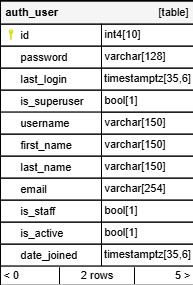  

**Empresa**  
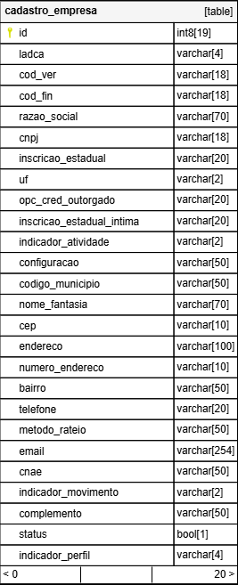  

**Empresa Regra**  
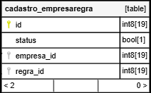  

**Regra**  
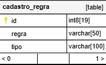  

**Historico**  
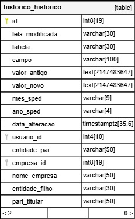  

**Permissões**  
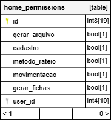  

**Análise K23x**  
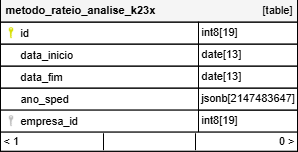  

**Análise K25x**  
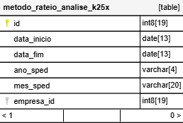  

**Insumos Usados 235**  
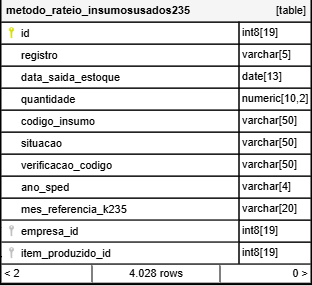  

**Insumos Usados 255**  
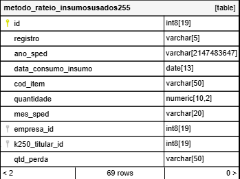  

**Itens Produzidos 230**  
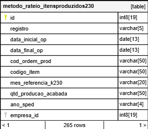  

**Itens Produzidos 250**  
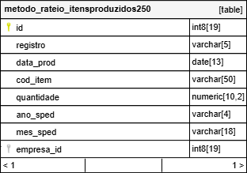  

**Planilha Custo**  
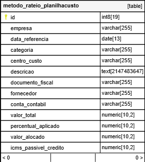  

**Cadastro Itens Sped**  
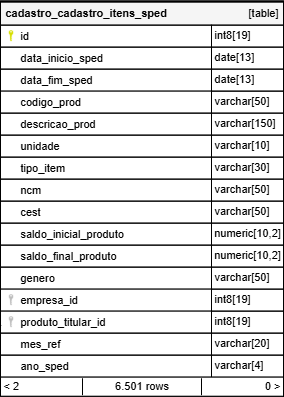  

**Participantes**  
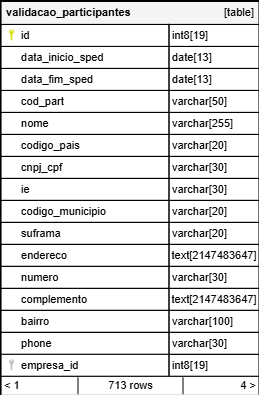  

**Notas Participantes**  
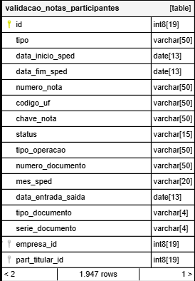  

**Produtos Notas**  
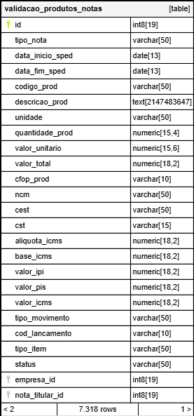  

**Registro Comunicação D500**  
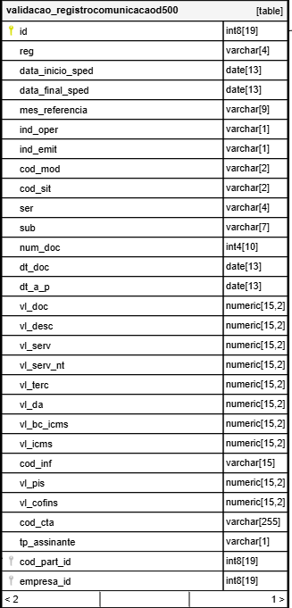  

**Registro Comunicação D590**  
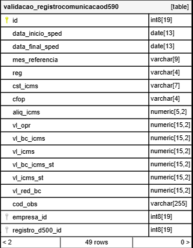  

**Registro Energia C500**  
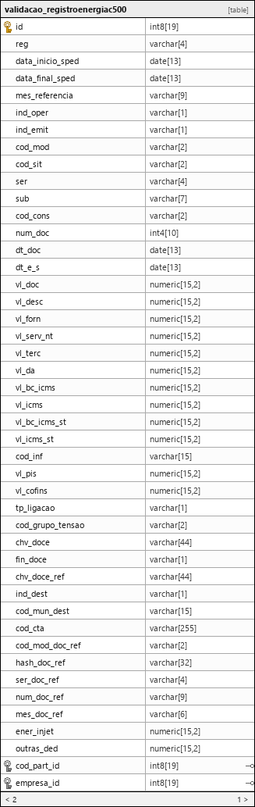  

**Registro Energia C590**  
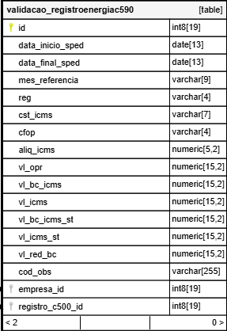  

**Registro Transporte D100**  
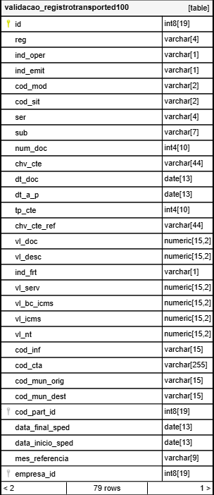  

**Registro Transporte D190**  
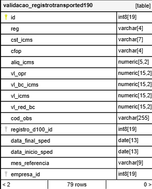  

**Validação Data Concluída**  
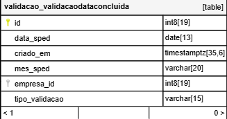  

**Validação Status**  
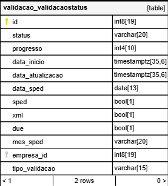

### **7.4 Relacionamentos**

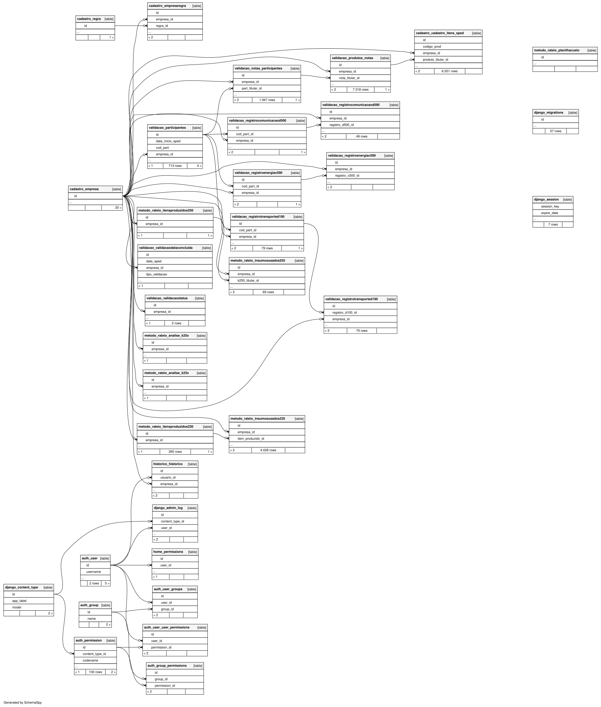

# **9. Processamento de arquivos**


### **9.1 Como o sistema recebe os arquivos**

O usuário realiza o upload do arquivo pelo sistema. Internamente a views recebe a requisição do usuário e chama as funções reponsáveis.

### **9.2 Quais formatos são aceitos**

O sistema aceita formatos de arquivo `.txt`, `.xml` e `.xlsx`

### **9.3 Como os arquivos são lidos/processados**


### **9.3 Como os arquivos são lidos/processados**

Após o envio, o sistema identifica o tipo de arquivo e utiliza o processamento correspondente ao seu formato. Os dados são extraídos e estruturados para posteriormente serem utilizados nas validações, cálculos e demais processos do sistema.

### **9.4 Quais módulos/classes fazem o processamento**


| Arquivo | Classes                                             |
| ------- | --------------------------------------------------- |
| .txt    | ProcessSpedXml, ProcessOutrosModelos, ProcessBlocoK |
| .xml    | ProcessSpedXml                                      |
| .xlsx   | ProcessDueServices, ProcessCusto                    |


### **9.5 Fluxo de processamento**


Este diagrama ilustra o fluxo de processamento, indo desde o envio do arquivo pelo usuário até o retorno das informações processadas.

### **9.6 Validações realizadas**


| Formato de Arquivo | Validações Realizadas Antes do Processamento                                                                                               |
| ------------------ | ------------------------------------------------------------------------------------------------------------------------------------------ |
| .txt               | - Verifica se o arquivo é `.txt` - Garante que a empresa vinculada não está inativa - Confirma que a empresa está cadastrada               |
| .xml               | - Verifica se o arquivo é `.xml` - Verifica se o XML está como dict, se necessário, conforme regras implementadas na classe ProcessSpedXml |
| .xlsx              | - Verifica se o arquivo é `.xlsx` - Verifica se foi enviado a razao_social e data_referencia - Valida se tem valores na planilha           |


### **9.7 Onde os dados processados são armazenados.**

Após a extração e o processamento, os dados obtidos dos arquivos são armazenados nas respectivas tabelas do banco de dados, de acordo com o tipo de informação processada. Dessa forma, os dados ficam disponíveis para consultas, validações, cruzamentos e demais funcionalidades do sistema.

# 10. Regras de Negócio


### 10.1 Estrutura de regras por empresa

O sistema possui a pasta `regras_companies`, responsável por concentrar regras específicas aplicadas durante o processamento dos dados de cada empresa.

As regras são utilizadas para tratar particularidades existentes nos dados recebidos, permitindo que o processamento seja adaptado conforme as necessidades de cada empresa.

### 10.2 Aplicação das regras

As regras são executadas durante o processamento dos dados e podem realizar tratamentos ou ajustes nas informações antes que elas sejam utilizadas pelas demais etapas do sistema.

### 10.3 Exemplos de regras

Um exemplo de regra aplicada é o tratamento do código do produto. Em determinadas empresas, o código pode possuir o caractere `-`, sendo necessário removê-lo durante o processamento para adequar o valor ao padrão utilizado pelo sistema.

Exemplo:

```text
Código recebido: -123456
Código processado: 123456
```


# 11. Cálculos no Processamento


### 11.1 Cálculos no SPED (`extract_sped.py`)


#### 11.1.1 Valor do imposto por item

```bash
valor_imposto_item = valor_ipi + valor_st - valor_desconto
```

- **valor_ipi:** Campo 24 C170 — valor do IPI do item
- **valor_st:** Campo 18 C170 — valor do ICMS-ST do item
- **valor_desconto:** Campo 8 C170 — desconto do item

> Calcula o imposto líquido do produto considerando descontos. Este valor é somado ao produto no `valor_total` do item.

---


#### 11.1.2 Soma dos custos acessórios da nota

```bash
second_value = valor_frete + valor_seguro + despesa_acessoria
```

- **valor_frete:** Campo 17 C100
- **valor_seguro:** Campo 18 C100
- **despesa_acessoria:** Campo 19 C100

> Soma de frete, seguro e despesas, que depois será dividida entre os itens.

---


#### 11.1.3 Valor unitário do produto

```bash
valor_unitario = valor_prod / quantidade
```

- **valor_prod:** Campo 7 C170 — valor bruto do produto
- **quantidade:** Campo 5 C170

> O valor unitário é calculado, pois não vem informado diretamente.

---


#### 11.1.4 Rateio dos custos acessórios entre os itens

- **valor_para_rateio:** soma de frete + seguro + despesas
- **n:** número de itens na nota

**Se não há custos acessórios:**

```bash
valor_total = valor_prod + valor_imposto
```

Só soma produto + imposto.

**Se há custos acessórios:**

```bash
base_share = valor_para_rateio / n
valor_total = valor_prod + valor_rateado + valor_imposto
```

Divide igualmente entre os itens; o último recebe a diferença do arredondamento.

---


### 11.2 Cálculos no XML (`extract_xml.py`)


#### 11.2.1 Valor unitário do produto

```bash
valor_unitario = valor_prod / quantidade_prod
```

- **valor_prod:** XML `vProd`
- **quantidade_prod:** XML `qCom`

> Calculado porque o XML não traz valor unitário próprio.

---


#### 11.2.2 CST com 3 dígitos

```bash
cst_3digitos = orig + cst
```

- **orig:** XML `orig` (1 dígito)
- **cst:** XML `CST` (2 dígitos)

> No XML vem separado, mas precisa juntar para ter 3 dígitos.

---


#### 11.2.3 Imposto por item

```bash
calculo_imposto_item = valor_st_item + valor_ipi_item
```

- **valor_st_item:** XML `vICMSST`
- **valor_ipi_item:** XML `vIPI`

> Soma os impostos e incorpora ao valor do produto.

---


#### 11.2.4 Valor para rateio da nota

```bash
valor_para_rateio = valor_frete + valor_seguro + valor_outros - valor_desconto
```

- **valor_frete:** XML `vFrete`
- **valor_seguro:** XML `vSeg`
- **valor_outros:** XML `vOutro`
- **valor_desconto:** XML `vDesc`

> Esses totais são rateados entre todos os itens.

---


#### 11.2.5 Rateio dos custos acessórios entre os itens

- **n:** número de itens na nota

**Sem custos acessórios:**

```bash
valor_total = valor_prod + calculo_imposto_item
```

**Com custos acessórios:**

```bash
base_share = valor_para_rateio / n
valor_total = valor_prod + valor_rateado + calculo_imposto_item
```

O último item corrige o arredondamento.

> Assim, os custos (frete, seguro, etc.) são distribuídos corretamente entre os itens, como manda a legislação.


# 12.1 Tratamento de erros

Durante o processamento dos arquivos, o sistema realiza tratamentos para evitar que erros interrompam indevidamente a execução das funcionalidades.

Os erros são tratados de acordo com a etapa em que ocorrem, podendo estar relacionados a arquivos inválidos, dados ausentes, informações inconsistentes ou falhas durante o processamento.

### 12.2 Erros de processamento

Quando ocorre um erro durante o processamento, o sistema realiza o tratamento da exceção e retorna a informação correspondente para a funcionalidade responsável, permitindo que o usuário seja informado sobre o problema quando necessário.

### 12.3 Registro de logs

O sistema utiliza logs para registrar informações importantes sobre a execução das funcionalidades, facilitando o acompanhamento e a identificação de problemas durante o processamento.

Os logs podem auxiliar na identificação de erros, falhas de processamento e demais ocorrências relevantes para manutenção e suporte do sistema.

### 12.4 Finalidade dos logs

Os registros têm como objetivo facilitar a análise de problemas, o acompanhamento da execução do sistema e a manutenção das funcionalidades.

# 13. Segurança


### 13.1 Autenticação

O acesso ao sistema é realizado por meio de autenticação, permitindo identificar o usuário antes de disponibilizar as funcionalidades do sistema.

### 13.2 Controle de acesso

O sistema realiza verificações de permissão para controlar o acesso às funcionalidades disponíveis para cada usuário.

### 13.3 Proteção das informações

Informações de configuração e credenciais utilizadas pelo sistema são mantidas em variáveis de ambiente, evitando que dados sensíveis sejam armazenados diretamente no código-fonte.

### 13.4 Controle das ações dos usuários

As alterações e ações realizadas pelos usuários podem ser registradas no histórico do sistema, permitindo identificar o usuário responsável pela operação e manter a rastreabilidade das ações realizadas.

### 13.5 Segurança no processamento dos arquivos

Os arquivos enviados ao sistema são processados de acordo com os formatos suportados e passam pelas etapas de validação e processamento antes que seus dados sejam utilizados pelo sistema.

# **14. Configuração e Instalação**


### **14.1 Requisitos**

```bash
Python 3.10 ou superior
Django 6.0.4 ou superior
PostgreSQL 12 ou superior
pip e Git
Ambiente virtual (`venv`)
```


### **14.2 Instalação**


#### 14.2.1 Clone e ambiente virtual

```bash
git clone <url-do-repositorio>
cd RNV_ECREDAC

# Windows
python -m venv venv
venv\Scripts\activate

# Linux / macOS
python3 -m venv venv
source venv/bin/activate
```


#### 14.2.2 Dependências

```bash
pip install -r requirements.txt
```

O `settings.py` usa `python-dotenv`. Se o pip não instalar esse pacote pelo `requirements.txt`, instale à parte:

```bash
pip install python-dotenv
```


### **14.3 Configuração**


#### **14.3.1 Banco PostgreSQL**

No PostgreSQL, crie o banco (o nome pode ser outro, desde que bata com o `.env`):

```sql
CREATE DATABASE ecredac;
```

O usuário precisa ter permissão nesse banco. Em ambientes locais costuma-se usar o usuário `postgres`.

#### **14.3.2 Arquivo** `.env`

O projeto **não** lê usuário e senha direto no `settings.py`. Crie um `.env` na raiz (esse arquivo já está no `.gitignore`):

```env
DB_NAME=ecredac
DB_USER=postgres
DB_PASSWORD=sua_senha
DB_HOST=localhost
DB_PORT=5432
```

O Django carrega essas variáveis em `project/settings.py` via `load_dotenv()`.

### **14..3.3 Migrações e superusuário**

```bash
python manage.py migrate 
python manage.py createsuperuser
```

O superusuário acessa o Django Admin (`/admin/`). As telas do sistema (home, cadastro, validação etc.) usam o login em `/login/`.

Crie também a pasta de logs, se ainda não existir:

```bash
mkdir logs
```

Erros do Django são gravados em `logs/django.log`.

### **14.4 Execução do Sistema**

```bash
Python manage.py runserser
```

- Sistema: [http://127.0.0.1:8000/](http://127.0.0.1:8000/) (redireciona para o login)
- Admin: [http://127.0.0.1:8000/admin/](http://127.0.0.1:8000/admin/)

Na tela de login é possível escolher o modo de acesso (sistema ou admin).